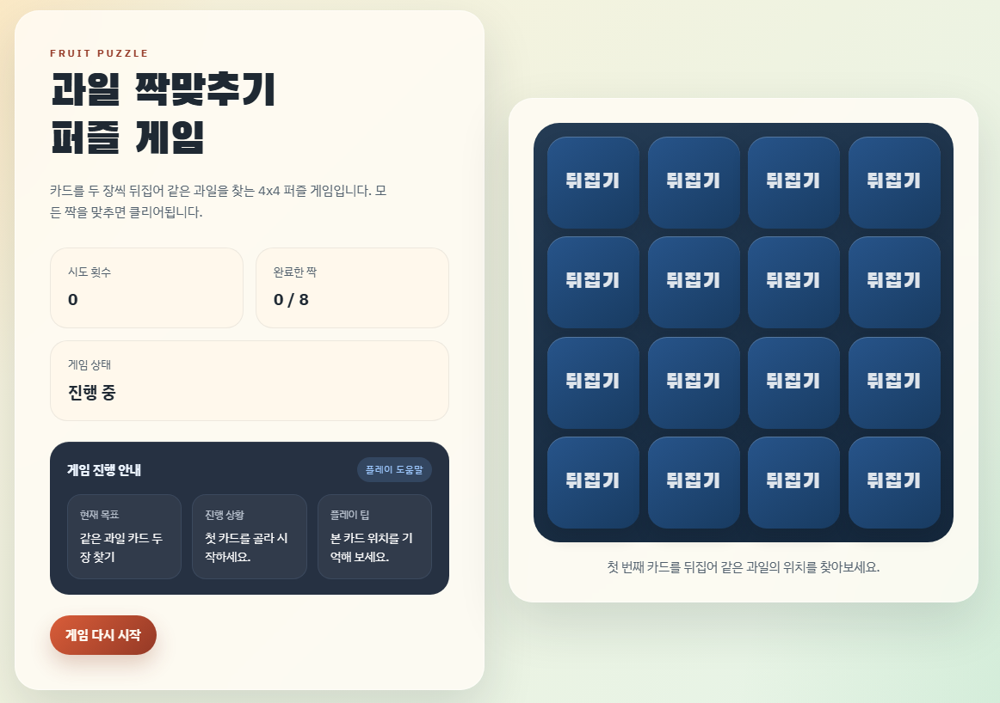

# puzzle-game

## 실행 화면

아래 이미지는 실제 클라우드 서버에 배포한 뒤 웹에서 실행한 화면입니다.



## 카드 데이터는 어떻게 만들어질까요?

이 퍼즐게임의 카드는 "과일 목록"으로부터 만들어집니다.

아주 쉽게 말하면 이런 순서예요.

1. 과일들을 먼저 준비해요.
2. 과일 하나마다 똑같은 카드 2장을 만들어요.
3. 만들어진 카드들을 섞어요.
4. 섞인 카드를 게임판에 올려서 게임을 시작해요.

## 1. 과일 목록 준비

`js/utils.js` 파일에는 게임에서 사용할 과일 목록이 들어 있습니다.

예를 들면 이런 정보가 들어 있어요.

- 과일 이름
- 과일 그림 파일 위치

즉, 이 목록은 카드의 "재료 상자" 같은 역할을 합니다.

## 2. 과일 하나로 카드 2장 만들기

`js/game.js` 파일의 `createDeck()` 함수가 카드 묶음을 만듭니다.

이 함수는 과일 하나를 보면 같은 카드 2장을 만들어요.

예를 들어 사과가 있으면:

- 사과 카드 1장
- 사과 카드 1장 더

이렇게 만들어서 "짝 맞추기"를 할 수 있게 해줍니다.

카드 하나에는 이런 정보가 들어 있습니다.

- `id`: 카드마다 다른 이름표
- `fruit`: 어떤 과일 카드인지 알려주는 정보
- `pairId`: 같은 짝인지 확인하는 번호
- `matched`: 이미 맞춘 카드인지 표시하는 값

예시:

```js
{
  id: "0-a",
  fruit: { name: "apple", image: "assets/images/fruits/apple.svg" },
  pairId: 0,
  matched: false
}
```

## 3. 카드 섞기

카드가 다 만들어지면 `js/utils.js` 파일의 `shuffle()` 함수가 순서를 섞어 줍니다.

이 과정은 책상 위에 카드를 뒤집어 놓고 이리저리 섞는 것과 비슷해요.

그래서 같은 과일 카드 2장이 어디에 있는지 바로 알 수 없게 됩니다.

## 4. 게임 시작할 때 카드 저장하기

`js/app.js` 파일의 `startGame()` 함수에서 아래 코드를 실행합니다.

```js
state.cards = createDeck(FRUITS, shuffle);
```

이 코드는 이런 뜻이에요.

- `FRUITS`: 원래 과일 목록을 가져오고
- `createDeck()`: 과일마다 카드 2장씩 만들고
- `shuffle`: 그 카드를 섞어서
- `state.cards`: 지금 게임에서 쓸 카드 목록으로 저장한다

## 한 번에 정리하면

이 게임의 카드 데이터는 아래 순서로 만들어집니다.

`과일 목록 준비 -> 카드 2장씩 만들기 -> 섞기 -> 게임에서 사용하기`

## 관련 파일

- `js/utils.js`: 과일 목록과 카드 섞기
- `js/game.js`: 카드 데이터 만들기
- `js/app.js`: 게임 시작할 때 카드 저장하기
- `js/board.js`: 저장된 카드 데이터를 화면에 보여주기
